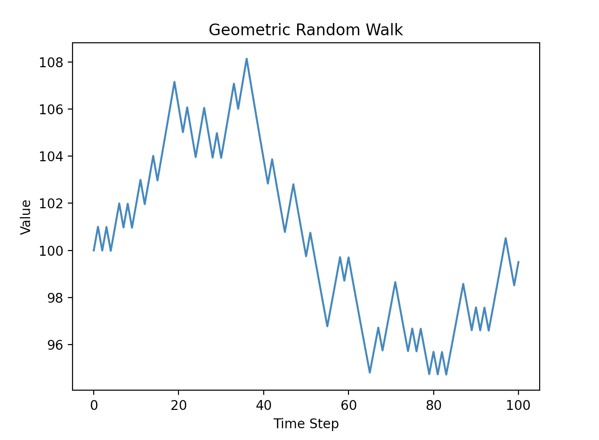
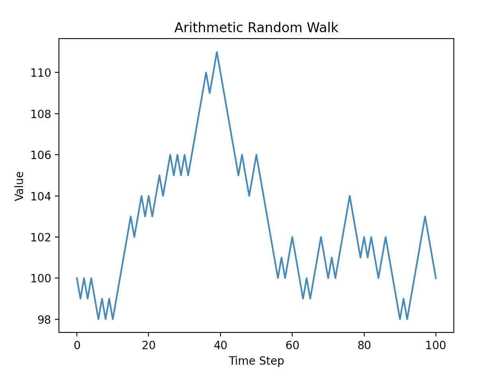

This folder implements both geometric and 
arithmetic random walks. The code 
can be run like this: 
```
python demo.py --mode="geometric" --p_up=0.5 --inc_factor=1.01 --dec_factor=0.99 --num_steps=100 --start_val=100
```
to create a geometric walk or 
like this: 
```
python demo.py --mode="arithmetic" --p_up=0.5 --inc_factor=1 --dec_factor=-1 --num_steps=100 --start_val=100
```
to create an arithmetic walk.
Of the above flags, the mode, 
inc_factor, and dec_factor 
are required and do not 
have default values.

Example results:

