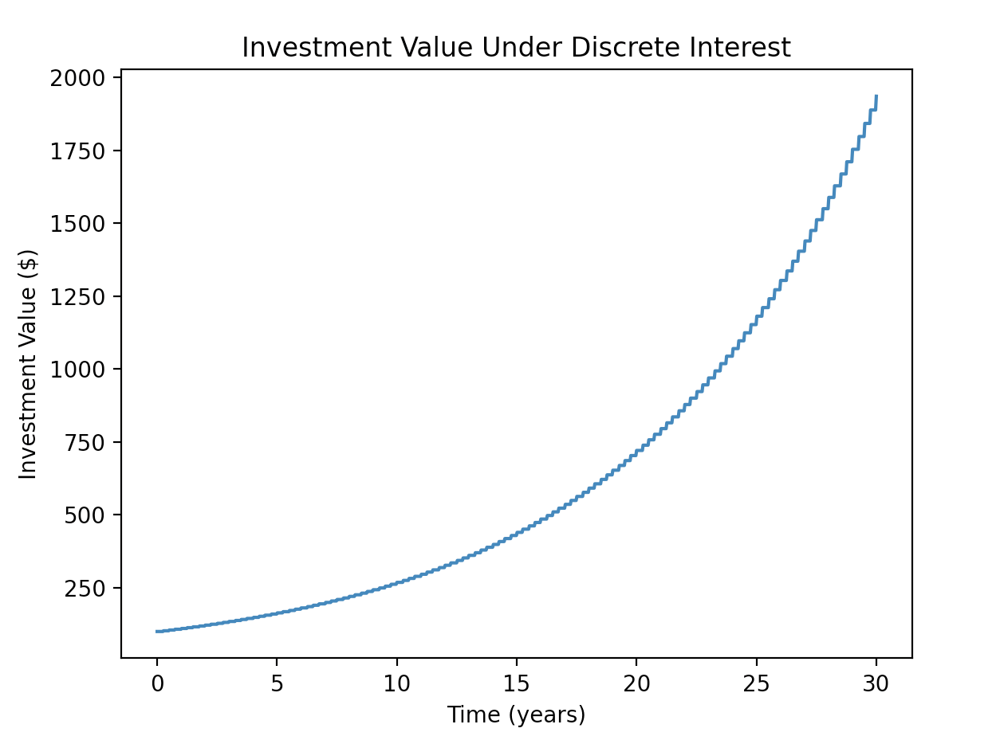

This folder implements simple, 
discrete compounding, and 
continuous compounding interest.

For example, the following code: 
```
python demo.py --type='discrete' --time=30 --rate=0.1 --initial=100 --num_payments=4 --num_intervals=1000
```
generates this graph: 


You can 
modify the command line arguments to 
change the investment parameters.
For instance, try changing --type between 
'simple' 'discrete' and 'continuous' 
and see what happens.